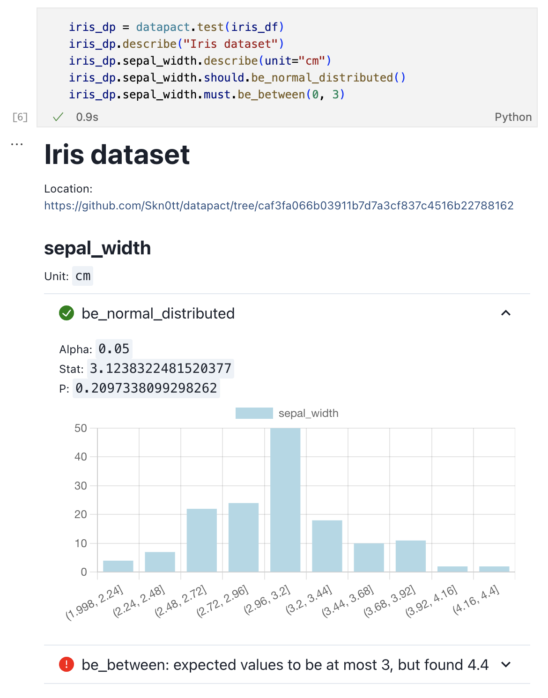

# Summary

It is crucial to have a good understanding of the datasets that are being worked with. For static datasets, users can explore the dataset once, and document their findings for other team members to consume.
For frequently changing datasets, this may not be sufficient.
After exploring, analysing and documenting it once, an understanding needs to be continously verified to be up-to-date, and adjusted when it is not.
To address these problems, we developed `datapact`, a Python library that provides an ergonomic API for running assertions on DataFrames.

`datapact` is available under MIT license at https://github.com/skn0tt/datapact.

# Statement of need

When working with continually changing datasets, e.g. occupancy statistics for intensive care units during a pandemic, dataset shift (@moreno2012unifying) will occur frequently.
Some common causes of data shift are human errors in data entry, bugs, errors or outages in the data delivery, or simply changes in the underlying data.
If these changes stay unnoticed, they can make their way into subtle bugs, faulty visualisations and ultimately lead to suboptimal decisions.
The faster they get noticed, the faster analysis scripts, dashboards and data pipelines can be updated.

Without dedicated systems to detect them, changes can often go unnoticed for months.
`datapact` enables such a system to be built easily, so changes are noticed as the data comes in.
It is a Python library for expressing and verifying characteristics on DataFrames, and can be embedded right within the Python scripts and Jupyter notebooks that are already being used for analysis.
Different tests are supported, both simple sanity checks ("the patient's age should be between 0 and 125") and more complex characteristics ("the age should be normally distributed").
More specialized tests can easily be added via custom code.

Existing projects addressing this need, e.g. Great Expectations (@Gong_Great_Expectations), come with comparatively high entrance hurdles that are hard to overcome, particularly for non engineering heavy organisations.

With `datapact`, we provide an easily usable library that is designed to be used by researchers, industry data scientists and data engineers alike.
For teams there is `Datapact Track`: the optional web-app that tracks test results, and notifies about failures via E-Mail, Slack, Microsoft Teams, or PagerDuty.

# Method

Qualitative interviews across a variety of research and industry organisations were conducted to learn about the problem of unnoticed dataset shift.
After evaluating prior art, the idea of an assertion library was identified as a potential solution to the problem.
To ensure that `datapact`'s developer-facing API is intuitive and ergonomic to use, the authors performed informal experiments where developers without prior knowledge about the problem were asked to explain what they think a given `datapact` snippet did.

To ensure high code quality, `datapact` maintains 100% code coverage via unit tests, automatically executed by our continuous integration.
Code style is linted via pylint (@pylint), pyright (@pyright) and Prettier (@prettier).
Documentation is auto-generated from docstrings (@goodger2010docstring).

# Example

```python
iris dp = datapact.test(iris_df)
iris_dp.describe("Iris dataset")
iris dp.sepal_width.describe(unit="cm")
iris_dp.sepal_width.should.be_normal_distributed()
iris_dp.sepal_width.must.be_between(0, 3)
iris_dp.check() # raises exception if assertion failed
```



# Future Work

Future work on `datapact` could happen in multiple areas.
One possible extension would be the addition of more _built-in assertions_, extending `datapact` to more application areas out-of-the-box. This could be general statistical tests, but also assertions on domain-specific datatypes like geocoordinates, addresses, currencies or IP addresses.
Adding support for _dataset segmentation_ would allow asserting on a subset of the data, allowing more granular tests.
Furthermore, enabling _multi-variable tests_ over multiple colums would allow for tests for e.g. correlation or relational integrity.

# Acknowledgements

We acknowledge contributions from the author's coworkers at Netlify, NET CHECK's Team, Robert Koch Institute,
and other participants that brought invaluable perspectives to the research interviews.

# References
